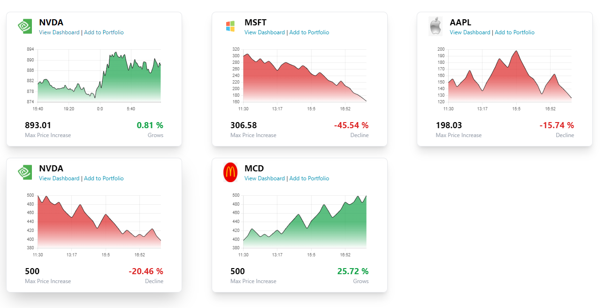

# Teast project: Financial Dashboard Widget with US Stock Market Data

## Getting Started with React App

```
git clone https://github.com/ClydeUrov/finance

cd finance

npm install

npm start

npm test
```

### In this project the following were created:

- One page with StockPriceWidget
- Stock Cards component
- Loader component using react-loader-spinner
- Chart component using react-chartjs-2 and chart.js

- Connection to API alphavantage.co in alphaVantageAPI.ts
- Connection to devapi.ai in devAPI.ts (not used)
- Connection to fake stock
Note: alphavantage.co only provides 25 requests per day, so the all data may not be visible.

- Some tests using Jest in src\components\__tests__
Note: Lack of time affected them..) I need little more time for create more interesting and practical tests without fails.

- Types

### Technologies used in the project:

- react
- axios
- chart.js
- typescript
- jest
- tailwindcss


#### Print Screen

